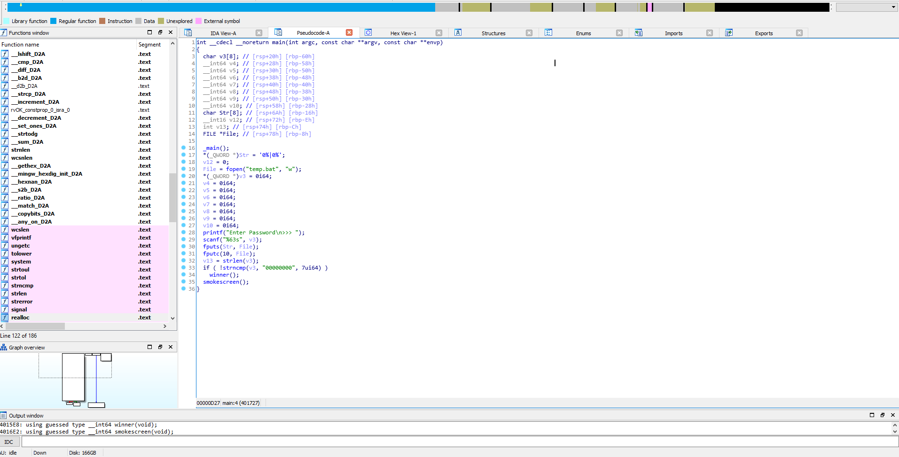
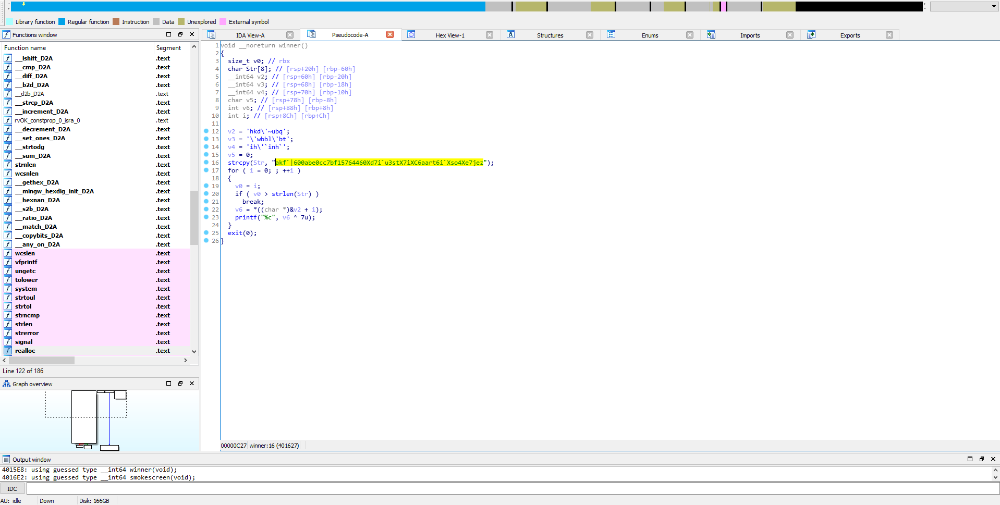

# Bomb Defusal 
We got a login console malware :-P

## Target 
[\*] Find Password  
[\*] Get The FLAG!!!!!!  

## Solution 
lets head to analysis the malware using IDA Pro.
 
Here We get a lot things 
**[\-] the malware write bat script called `temp.bat` and write `0%|0%`** 
**[\-] Also its request for password and check if it equal to 00000000, Length = 7**
**[\-] if we enter the password correct it will call function named `winner`**
**[\-] Lets Jump to it :D**
 
**[\-] Here it will Print not that easy or something like this**
**[\-] But there is someting intersting we got string "akf\`|600abe0cc7bf15764460Xd7i\`u3stX7iXC6aart6i\`Xso4Xe7jez\`", and XOR key 0x07**
**[\-] the string used in the code but not printed....**
**[\-] Xor this string with 0x07 we will get the flag...**
## YES THATS EASY :-P 
flag{177feb7dd0ea62013317_c0ngr4ts_0n_D1ffus1ng_th3_b0mb}